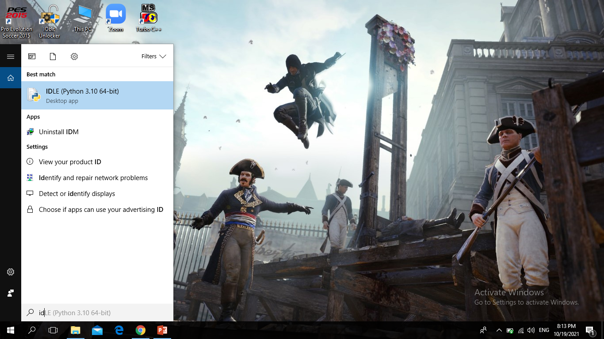
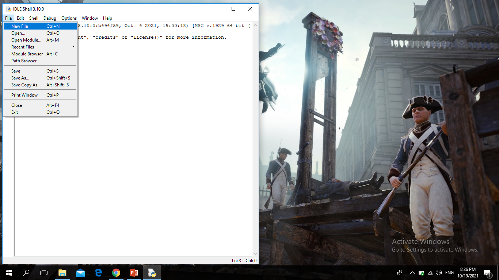
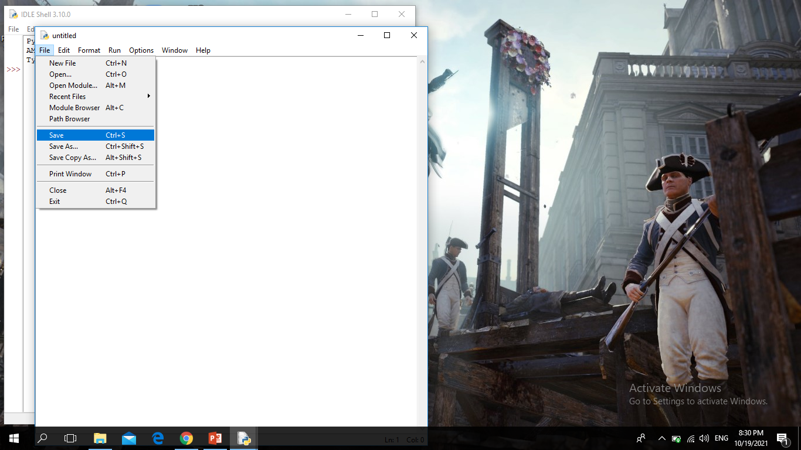
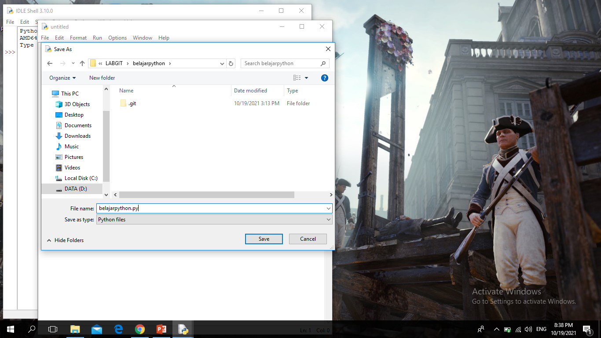
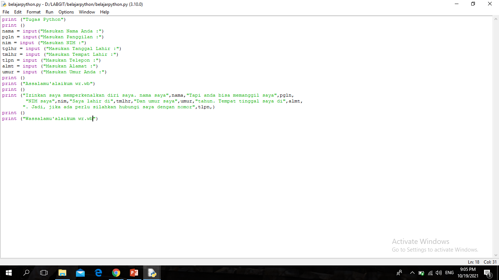
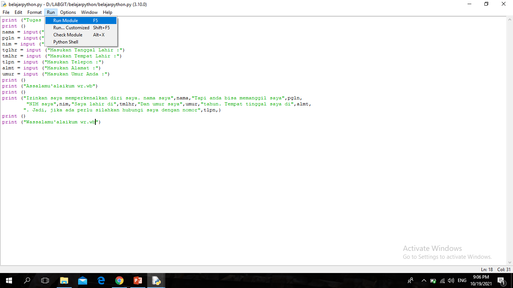
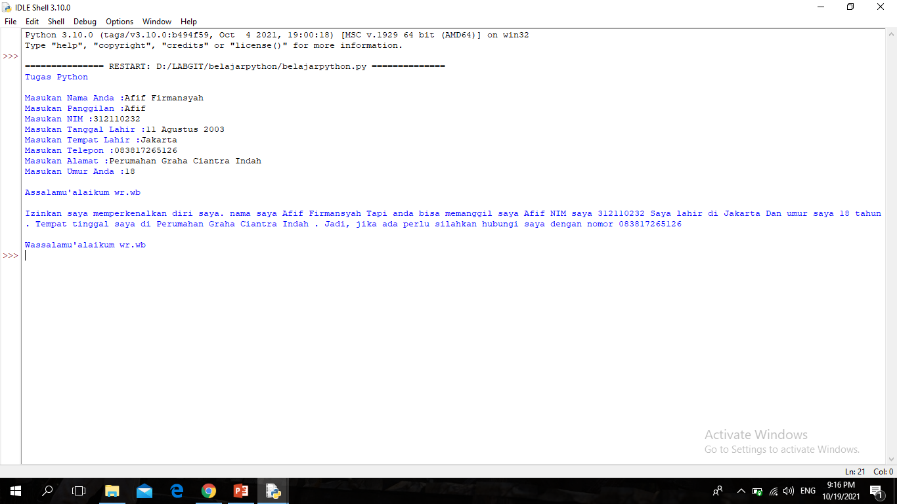

# belajarpython
## Belajar Input Menggunakan Python

1.Buka IDLE Python di pencarian (search) 

2.Klik (File-New File) 

3.Setelah itu Klik (File-Save) 

4.Lalu pilih tempat untuk menyimpan file Pythonnya "JANGAN LUPA Menggunakan Format.py" 

5.Koding bebas sesuai mau kalian 

6.Setelah selesai koding, lalu pilih (Run-Run Module) untuk menjalankan program kodingan 

7.Output 

8.SELESAI 

### Sekian Terima Kasih